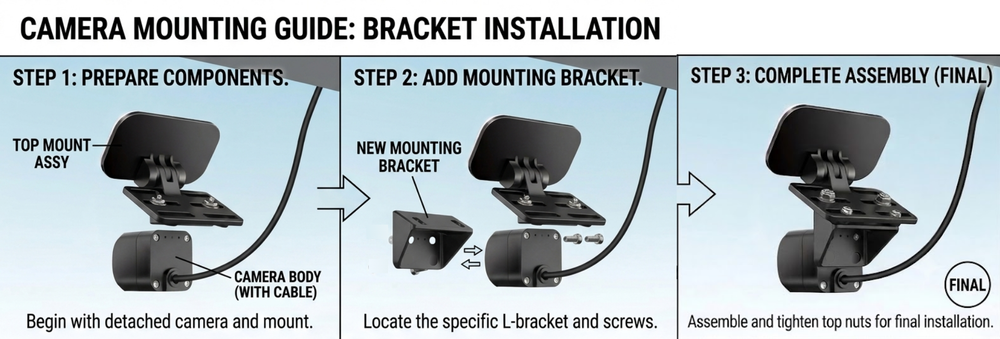

# Vision Pilot Sensing Guide

## Single Camera - 50 - 55 degree H-Fov and 2MP resolution

For the baseline version of Vision Pilot, we recommend using an automotive grade camera with a GMSL2 interface, 2MP resolution and a horizontal field of view between 50 and 55 degrees. Cameras with wider field of view are not suitable since such cameras lack the ability to capture the scene at a longer range, required for highway driving and ADAS safety features. The Vision Pilot stack is designed to run at 10Hz, although you can run it at higher FPS - we recommend 10Hz. Average human drivers have a reaction time equivalent to 4Hz and F1-drivers have an average reaction time of 8Hz, so Vision Pilot provides super-human reaction speeds whilst operating at 10Hz.

### Mounting the camera

We recommend mounting the camera behind the front windscreen, underneath the rear-view mirror - similar to how stock ADAS cameras are mounted by automotive OEMs. The camera should be mounted with zero roll angle along the centreline of the vehicle facing forward, with a slight pitch angle downward of 1-3 degrees for passenger cars and a larger pitch down angle of between 10-15 degrees for taller vehicles such as shuttles, buses or trucks.

Typically, automotive GMSL evaluation cameras are designed with screw holes which can be used to mount the camera to the body frame. We recommend using an L-brack which affixes to the back face of the camera using the pre-designed screw-holes available in most cameras.

We recommend using the [Pixelman camera mount](https://www.amazon.com/Pixelman-Adhesive-2PCS-Universal-Windshield-Bracket/dp/B0C5XQ8ZX8) - although it is typically designed for adding cameras to the rear windsheild, it can also easily be used to mount a camera to the front windshield.

To attach your automotive camera to the Pixelman camera mount, you will need to use an L-faced bracket which screws into the back face mounting holes of your automotive camera and then screws into the mounting plate of the Pixelman camera as per the above reference image. 

