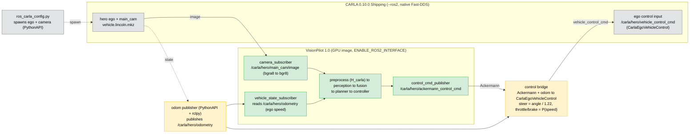

# Driving VisionPilot 1.0 in CARLA UE5 (0.10.0) over ROS2

This guide runs the **VisionPilot 1.0 single-binary app** as a camera-only Level-2 driver
inside **CARLA UE5 0.10.0**, talking entirely over ROS2. CARLA renders a front camera and
moves the car; VisionPilot does all the perception, planning and control and sends back a
steering + speed command. Nothing about VisionPilot is CARLA-specific — CARLA is just one
ROS2 peer behind a thin, configurable seam.

## How it fits together

VisionPilot speaks a **vehicle-agnostic** language: it consumes a camera image and emits an
`ackermann_msgs/AckermannDriveStamped` (a steering angle in radians + a target speed). It
never knows it is talking to CARLA. Two small glue processes adapt CARLA to that contract:

- **odom publisher** — CARLA 0.10 does *not* publish the ego's odometry, so this PythonAPI
  node reads the ego state and publishes `nav_msgs/Odometry`. VisionPilot uses it for live
  ego speed; the control bridge uses it for its speed controller.
- **control bridge** — the CARLA 0.10 **Shipping** ego only accepts
  `carla_msgs/CarlaEgoVehicleControl` (throttle/brake/steer in [-1, 1]); it has no native
  Ackermann input. The bridge converts VisionPilot's Ackermann command into that message.



## Topics

All VisionPilot topics are configured in `VisionPilot/config/vision_pilot_carla.conf.example`;
the glue defaults match. The `/carla/hero/...` names come from the ego/sensor `ros_name`
(set by the spawn helper) and CARLA's native ROS2 naming.

| Topic | Type | Direction | Produced by |
|---|---|---|---|
| `/carla/hero/main_cam/image` | `sensor_msgs/Image` (`bgra8`, 1280×720) | CARLA → VP | CARLA native `--ros2` |
| `/carla/hero/odometry` | `nav_msgs/Odometry` | → VP + bridge | odom publisher |
| `/carla/hero/ackermann_control_cmd` | `ackermann_msgs/AckermannDriveStamped` | VP → bridge | VisionPilot |
| `/carla/hero/vehicle_control_cmd` | `carla_msgs/CarlaEgoVehicleControl` | bridge → CARLA | control bridge |

## Prerequisites

- **CARLA UE5 0.10.0** unpacked locally (e.g. `~/Carla-0.10.0-Linux-Shipping`).
- The **CARLA PythonAPI wheel** for a Python ≤ 3.12 interpreter (the wheels ship as
  `PythonAPI/carla/dist/carla-0.10.0-cpXX-*.whl`). The spawn helper runs on the host; a
  Python 3.10–3.12 env works (`pip install carla-0.10.0-cp310-*.whl`).
- **Docker** + the **NVIDIA container runtime** (the VisionPilot image does GPU inference).
- **Model weights** (`autodrive_fp32.onnx`, `autosteer_fp32.onnx`, `autospeed_fp32.onnx`) in
  a host directory — they are not in git (see the model READMEs / OpenADKit `download-assets.sh`).
- A GPU with a recent driver. On Blackwell (RTX 50-series, sm_120) the image uses **ONNX
  Runtime GPU 1.23.2**, which JITs its kernels to sm_120 on first inference.

## Reduce CARLA VRAM (one-time, required)

Stock CARLA 0.10 ships with ray tracing and Lumen global illumination on. They exhaust a
small fixed Vulkan heap and crash on startup with `Out of memory on Vulkan; MemoryTypeIndex=1`
— independent of how much VRAM is free. Disable them once in
`CarlaUnreal/Config/DefaultEngine.ini`, under `[/Script/Engine.RendererSettings]`:

```ini
r.RayTracing=False
r.Lumen.Enabled=0
r.Lumen.GlobalIllumination=0
r.Lumen.HardwareRayTracing=False
r.DynamicGlobalIlluminationMethod=0
r.RayTracing.Shadows=False
r.ReflectionMethod=2
r.GenerateMeshDistanceFields=False
r.DistanceFields.AtlasSizeXY=256
r.DistanceFields.AtlasSizeZ=512
r.Streaming.PoolSize=4000
r.ViewDistanceScale=0.5
```

CARLA then settles at ~6 GB and is stable across runs. Reference:
<https://gist.github.com/xmfcx/a5e32fdecfcd85c6cc9d472ce7a3a98d>.

## Build (once)

Three self-contained images — no host C++/ROS2 toolchain needed:

```bash
# VisionPilot GPU runtime (bakes the CARLA homography as config/H.yaml):
VisionPilot/Docker/build-carla-gpu.sh                      # -> visionpilot-carla-gpu

# Control bridge (carla_msgs built inside; no external artifacts):
Simulation/CARLA/ROS2/docker/control_bridge/build.sh       # -> carla-control-bridge

# Odom publisher (needs the version-matched cp312 CARLA wheel from your install):
CARLA_ROOT=~/Carla-0.10.0-Linux-Shipping \
  Simulation/CARLA/ROS2/docker/odom_publisher/build.sh     # -> carla-odom-publisher
```

## Run (staged bring-up)

> **Always start from a clean slate.** Stale CARLA actors and lingering DDS topics from a
> previous run collide with a new one (duplicate publishers, orphan ego → spawn collision).
> Tear everything down before *every* run and before any rebuild.

**1. Teardown (verify each is zero):**
```bash
docker rm -f $(docker ps -aq) 2>/dev/null
pkill -9 -f ros_carla_config; pkill -9 -f pub_odom_node
for p in $(pgrep -f CarlaUnreal); do kill -9 "$p"; done
# verify: docker ps -q | wc -l == 0 ; ss -ltn | grep :2000 is free ; nvidia-smi is idle
```

**2. CARLA server** (headless; drop `-RenderOffScreen` to watch a window):
```bash
~/Carla-0.10.0-Linux-Shipping/CarlaUnreal.sh -RenderOffScreen -nosound --ros2
# wait until RPC port 2000 is listening
```

**3. Spawn the ego + camera** (host, in the Python env with the carla wheel):
```bash
cd Simulation/CARLA/ROS2
python ros_carla_config.py -f config/VisionPilot_carla10.json
```

**4. Odom publisher** and **5. control bridge** (each in its own terminal):
```bash
Simulation/CARLA/ROS2/docker/odom_publisher/run.sh
Simulation/CARLA/ROS2/docker/control_bridge/run.sh
```

**6. VisionPilot** (mount the weights read-only):
```bash
VisionPilot/Docker/run-carla-gpu.sh /abs/path/to/weights_dir
```
This shows the VisionPilot window on `$DISPLAY` and persists the sm_120 JIT cache to
`~/.cache/vp_cuda` so later runs start fast. Set `HEADLESS=1` for an offscreen run (CI).

### Is it working?

```bash
# the bridge is listening to VisionPilot, and driving the ego:
ros2 topic info /carla/hero/ackermann_control_cmd   # Subscription count >= 1
ros2 topic info /carla/hero/vehicle_control_cmd      # Publisher count >= 1
```
VisionPilot logs `[Control] steer=… speed=… accel=…` each frame; the ego should move.
Run `ros2` from any sourced ROS2 shell or `docker exec` into a running container.

> **Tip — validate perception before driving.** Spawn the ego stationary and centered on a
> lane, cap the speed at 0, and read the steady-state cross-track error / yaw / curvature from
> the logs. On lane center those should be ~0; a constant offset points at the homography, not
> the controller.

## Homography (`H_carla.yaml`)

VisionPilot warps the full camera frame to a 1024×512 bird's-eye view before inference. That
warp needs a **ground homography** for *this* camera — image pixels → world ground (X forward,
Y left, metres). There are three homographies and only one is per-camera:

- **Ground H** — per-camera; this is `H_carla.yaml`, the only one you regenerate.
- **Model V** — the fixed VisionPilot 1024×512 → world view; hardcoded, do not touch.
- **Fusion** — must use the same model-view V.

`H_carla.yaml` is generated from the CARLA camera geometry, **not** its `camera_info`: CARLA
0.10 publishes a `camera_info` whose intrinsic matrix is unreliable (observed `fx ≈ 1e5` for a
1280px/60° camera that should be ~1108). The generator derives the intrinsics analytically:

```bash
# main_cam: 1280x720, fov 60, mount height 1.58 m, pitch 0 (from VisionPilot_carla10.json)
python VisionPilot/scripts/gen_carla_homography.py \
    --output Simulation/CARLA/ROS2/config/H_carla.yaml
```

The GPU image bakes this file in as `config/H.yaml` at build time, so the in-tree
`generate_config` codegen builds the matching preprocess matrix. If you change the camera
(resolution, fov, mounting), rerun the generator with the new `--fov/--cam-z/--pitch/...`
and rebuild the image.

## Tests

- **Control-bridge mapping** (pure, no ROS2/CARLA):
  `pytest Simulation/CARLA/ROS2/docker/control_bridge/test_control_bridge.py`
- **Camera bgra8→bgr8** and the other ROS2 adapters (in the ROS2 image):
  `VisionPilot/Docker/build.sh && VisionPilot/Docker/run.sh smoke`
  → `test_camera_subscriber`, `test_control_cmd_publisher`, `test_vehicle_state_subscriber`.

## Troubleshooting

- **No topics across the host/container boundary** → export
  `FASTDDS_BUILTIN_TRANSPORTS=UDPv4` (host↔container Fast-DDS shared memory is unreliable).
  All the `run.sh` scripts set it; a host `ros2` shell needs it too.
- **`std::exception` / "collision at spawn"** → a previous run wasn't torn down. Redo step 1.
- **Ego doesn't move** → check `/carla/hero/vehicle_control_cmd` has a publisher (the bridge),
  and that the spawn used a `vehicle.lincoln.mkz` ego with `ros_name: hero`.
- **No camera frames** → the spawn helper must call `enable_for_ros()` on the camera (the
  provided config does); confirm `ros2 topic hz /carla/hero/main_cam/image`.
- **CARLA crashes on startup with `Out of memory on Vulkan; MemoryTypeIndex=1`** → ray
  tracing / Lumen are still on; apply the *Reduce CARLA VRAM* edits above.
- **Slow first inference (~20 s)** on Blackwell → ONNX Runtime is JITing PTX to sm_120; the
  cache mount (`~/.cache/vp_cuda`) makes it a one-time cost across runs.
- **No VisionPilot window** → `run-carla-gpu.sh` uses the host `$DISPLAY` (xcb); ensure
  `$DISPLAY` is set. `HEADLESS=1` runs offscreen instead.

## What changed from the old pipeline

Earlier CARLA integrations relayed perception over shared memory and a Python control node
(`carla_control_publisher`, `visionpilot_publisher`, `waypoints_publisher`, …, still under
`src/`). Those are **superseded**: control now lives inside the single C++ `VisionPilot`
binary, which publishes Ackermann directly. Only the camera spawn (`ros_carla_config.py`),
the odom publisher, and the control bridge remain as CARLA glue.
