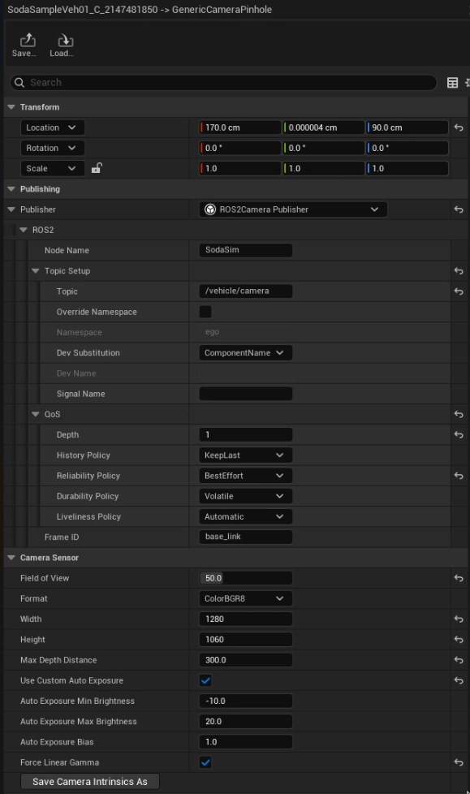

## SodaSim ↔ Autoware Integration Notes

Soda.Sim is an Unreal Engine–based simulator that publishes vehicle and sensor data over ROS 2. This document describes how to run the full **VisionPilot 0.9 + SodaSim 1.4.0** demo pipeline.

---

### Prerequisites

- SodaSim 1.4.0 downloaded from [github.com/soda-auto/soda-sim/releases](https://github.com/soda-auto/soda-sim/releases)
- ROS 2 Humble
- VisionPilot 0.9 built according to its instructions, with required model files in place
- v4l2loopback kernel module available (`sudo apt install v4l2loopback-dkms`)

---

### Quick start

#### 1. Load virtual device

```bash
sudo modprobe v4l2loopback devices=1 video_nr=10 card_label="SodaSim"
```

#### 2. Launch SodaSim 1.4.0

Launch SodaSim.

Open **Main Menu → Scenario Manager**, select `Demo_AdasVehicle_Camera` and click **Load**.


Click the **Scenario Play/Stop** button in the top-left toolbar to start publishing.

#### 3. Start the GStreamer bridge (ROS 2 → v4l2loopback)

```bash
# Build once (first time), from SodaSim/ros2_gstreamer/
source /opt/ros/humble/setup.bash
colcon build --symlink-install
source install/setup.bash

# Run (v4l2 mode)
ros2 launch sodasim_gstreamer image_to_gstreamer.launch.py mode:=v4l2
```

This bridges `/vehicle/camera` → `/dev/video10` via GStreamer (UYVY pixel format).

#### 4. Launch VisionPilot 0.9

Build VisionPilot 0.9 according to its own instructions in `autoware.privately-owned-vehicles/VisionPilot/Production_Releases/0.9/`, then:

```bash
visionpilot SodaSim/VisionPilot/visionpilot_sodasim.conf
```

Expected output: unified OpenCV window showing EgoLanes lane boundaries + AutoSpeed CIPO detection with distance/speed overlay.


---

### Camera configuration

The `Charge67_Autoware_VisionPilot` vehicle uses a forward-facing pinhole camera with:

| Parameter | Value |
|---|---|
| Resolution | 1280 × 1060 |
| FOV (horizontal) | 50° |
| Camera height | 0.90 m |
| Camera forward offset | 1.70 m |
| Pitch | 0° |
| ROS 2 topic | `/vehicle/camera` |
| Encoding | `bgr8` / `ColorBGR8` |
| QoS | `BestEffort`, `KeepLast(1)`, `Volatile` |

VisionPilot internally crops the frame to 1280 × 640 (top 420 rows removed), giving a clean 2:1 aspect ratio for the EgoLanes model input at 640 × 320.

To view or change camera settings in SodaSim: select the ego vehicle → `Open Vehicle Components` → expand `Camera Sensors` → select the camera → edit `Publishing` (ROS 2) and `Camera Sensor` (image) parameters.



---

### Homography calibration

VisionPilot's `ObjectFinder` uses a 3×3 homography `H` to project bounding-box bottom-centre pixels to real-world ground-plane coordinates `(X_forward, Y_lateral)` in metres.

A pre-calibrated matrix for the `Charge67_Autoware_VisionPilot` camera setup is provided at `SodaSim/VisionPilot/homography_sodasim.yaml` and referenced by `visionpilot_sodasim.conf`. If you change the camera mount position, FOV, or resolution, the homography must be recalibrated.

---

### Next steps

The next version of VisionPilot and SodaSim will support full closed-loop control — VisionPilot steering and longitudinal commands fed back directly into the simulated vehicle.

---

### Contact

- Email: `sim@soda.auto`
- Repo: `https://github.com/soda-auto/soda-sim`
